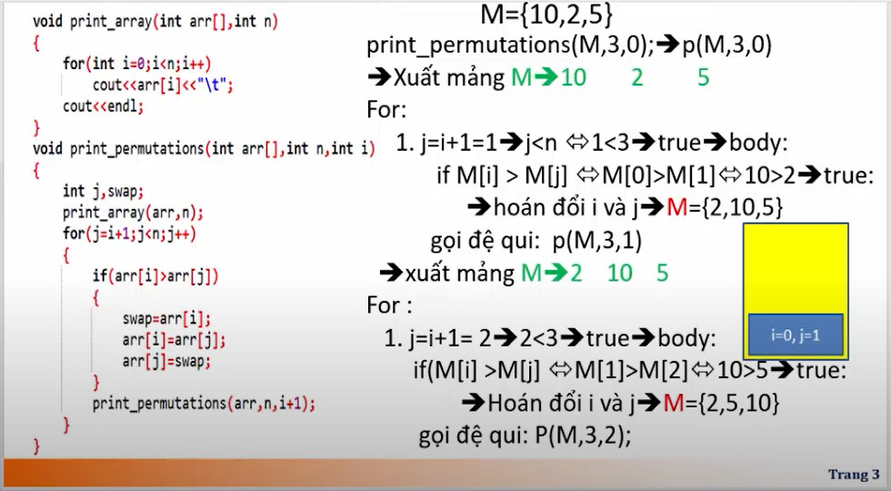

# Phần 1: Ôn tập C++

### Bài 1: Các nguyên lý của công nghệ phần mềm

1. Trừu tượng (Abstract): Loại bỏ các thành phần mang tính chi tiết định nghĩa một vấn đề nào đó
2. Module hóa (Modularity): Hạn chế độ phức tạp bằng cách phân chia ra nhiều phần (Chia để trị)
   - Phân chia bài toán thành các module nhỏ, thực hiện giải quyết từng module
   - Kết hợp các module
3. Che dấu thông tin (Information hiding)
   - Theo nguyên lý trừu tượng
   - Không cho phép truy nhập từ bên ngoài

### Bài 2: Cơ bản về ngôn ngữ lập trình C++

- Được phát triển dựa trên ngôn ngữ lập trình C
- C++ có một số mở rộng so với ngôn ngữ C như sau:
  - Khi nhập và xuất dữ liệu không phải xử dụng các định dạng (%d, %f, ...)
  - Hàm có đối mặc định và hàm có đối tham chiếu
    - Hàm có đối mặc định nghĩa là nếu trong lời gọi hàm mà không truyền giá trị cho tham số thì nó sẽ nhận giá trị mặc định
    - Hàm có đối tham chiếu
    - Nạp chồng hàm
    - Hàm mấu
    - Lớp

```CPP
#include<iostream>
using namespace std;

int main() {
	char ho_ten[50];
	char w[10];
	cin.ignore(1);
	cin.get(ho_ten, 50);
	cout << ho_ten << endl;
	cin.ignore(1);
	cin.get(w, 5);
	cout << w;
	return 0;
}
```

```CPP
tran tuan dat
ran tuan dat
hello men
hell
```

### Bài 3: Con trỏ

```cpp
int *p; // Khai báo con trỏ có tên là p và kiểu dữ liệu là int
p = new int; // Cấp phát bộ nhớ cho con trỏ p
*p = 100; // Gán giá trị 100 cho biến con trỏ p
cout << p; // In ra địa chỉ tại con trỏ p
cout << *p; // In ra giá trị tại địa chỉ của con trỏ p
delete p; // Thu hồi bộ nhớ, Nếu không thu hồi bộ nhớ thì sẽ bị memory leak
```

### Bài 4: Các toán tử trong con trỏ

- Có hai toán tử trong con trỏ là \* và &

  - Toán tử `&` là toán tử một ngôi mà trả về địa chỉ ô nhớ của toán hạng của nó (Toán tử một ngôi chỉ yêu cầu toán hạng)
  - Một biến con trỏ chỉ lưu trữ địa chỉ của một biến khác

- Ví dụ:

```cpp
int count;
int *m;
m = &count;
```

=> Lệnh `m = &count` đặt địa chỉ ô nhớ của biến count vào con trỏ m. Lệnh trên có thể phát biếu là `con trỏ m nhận địa chỉ của biến count`

- Toán tử con trỏ `*` là toán tử một ngôi trả về giá trị tại địa chỉ con trỏ trỏ đến
- Ví dụ: q = \*m

=> Lấy giá trị tại thanh địa chỉ mà m trỏ đến và đặt vào biến q. Như vậy q sẽ có giá trị là 100 (Là giá trị của biến count)

```cpp
#include<iostream>

using namespace std;

int main() {
	int count = 100;
	int *m = &count;
	cout << "Dia chi cua bien count: " << &count << endl;
	cout << "Gia tri cua bien count: " << count << endl;
	cout << "Dia chi cua con tro m: " << m << endl;
	cout << "Gia tri cua con tro m dang tro toi: " << *m << endl;

	int p = *m;
	cout << "Gia tri cua p: " << p << enld;
	int *x = m;
	cout << "Dia chi cua con tro x: " << x << endl;
	cout << "Gia tri cua con tro x dang tro toi: " << *x << endl;
	*x = 15;
	cout << "Gia tri cua con tro m dang tro toi: " << *m << enld;
	cout << "Gia tri cua bien count: " << count << endl;
	return 0;
}
```

### Con trỏ void và con trỏ null

1. Đặt vấn đề

- Lưu ý: Kiểu dữ liệu khi khai báo biến con trỏ chính là kiểu dữ liệu mà con trỏ có thể trỏ đến. Địa chỉ đặt vào biến con trỏ phải có cùng kiểu với kiểu con trỏ. Xem xét đoạn mã sau

```cpp
// Ta Có:
int a;
float f;
int *pa;
float *pf;
// Những lệnh sau là hợp lệ:
pa = &a;
pf = &f;
// Những lệnh sau là không hợp lệ:
pa = &f;    // pa là con trỏ có kiểu dữ liệu là int, do đó nó chỉ chứa địa chỉ của biến có kiểu là int
pf = &a;    // pf là con trỏ có kiểu dữ liệu là float, do đó nó chỉ chứa địa chỉ của biến có kiểu là float
```

2. Con trỏ void

- Con trỏ void là loại con trỏ đặc biệt mà có thể trỏ đến bất kì kiểu dữ liệu nào

```cpp
// Cú pháp khai báo
void *pointerVariable;
// VD
// Nếu khai báo con trỏ void sau:
void *p;
// Thì các lệnh sau đây là hợp lệ
p = &a; // Sau lệnh này, p trỏ đến biến nguyên a;
p = &f; // Sau lệnh này, p trỏ đến biến thực f
```

- Tuy nhiên, tùy thuộc con trỏ void đang trỏ đến kiểu dữ liệu nào, ta phải ép kiểu về đúng kiểu tương ứng khi dùng trong các biểu thức.
- Ví dụ p đang trỏ đến biến nguyên a, để tăng giá trị của biến a lên 10, ta phải dùng lệnh sau: `(*(int*)p) + 10`;
- Nếu p đang trỏ đến biến thực f, để tăng giá trị của biến f lên 10 ta phải dùng lệnh sau: (float*)*p + 10

```cpp
#include<iostream>

using namespace std;

int main() {
	int a = 10;
	float f = 2.5;
	int *pa = &a;
	float *pf = &f;

	*pa = 20;
	cout << a << endl; // 20

	void *p;
	p = &f;
	*(float*)p = 5.5;
	cout << f << endl;
	// Như dưới đây sẽ gặp lỗi
	int *y;
	cout << "gia tri cua y la: " << *y << enld; // Lỗi vì chưa cấp phát ô nhớ cho biến con trỏ y
    // Fix
    y = new int;
	return 0;
}
```

### Con trỏ và mảng

```cpp
#include<iostream>

using namespace std;

int main() {
	int a[] = {1, 2, 23, 34, 5, 26, 37, 8};
	int *p = a;
	for(int i = 0; i < 8; i++) {
		cout << *(p + i) << "\t";
	}
	cout << "\n------------------------------" << endl;
	for(int i = 0; i < 8; i++) {
		cout << p[i] << "\t";
	}
 	return 0;
}
```

### Mảng con trỏ

- Mỗi biến con trỏ là một biến đơn, ta có thể tạo mảng các con trỏ, Mỗi phần tử của mảng là một con trỏ thông thường. Cú pháp để khai báo mảng con trỏ là: `type *pointerArray[elements]` trong đó:
  - type: Kiểu dữ liệu mà các phần tử con trỏ trỏ đến
  - pointerArray: tên mảng con trỏ
  - elements: Số phần tử của mảng con trỏ

2. Con trỏ null

- Một con trỏ hiện hành không trỏ đến một địa chỉ bộ nhớ hợp lệ thì được gán giá trị NULL, bởi quy ước, con trỏ NULL là con trỏ không trỏ đến đâu cả và không nên dùng
- Nếu chương trình vô tình dùng con trỏ NULL thì sẽ nhận lỗi như dưới đây khi thực thi chương trình (run time error)

```cpp
int *p;
cout << "Giá trị con trỏ trỏ đến là: " << *p;
```

### Tương quan giữa mảng hai chiều và con trỏ cấp 2

```cpp
#include<iostream>

using namespace std;

int main() {
	int **p = new int *[5];
	for(int i = 0; i < 5; i++) {
		p[i] = new int[7];	//  *(p + i) = new int[7];
	}

	for(int i = 0; i < 5; i++) {
		for(int j = 0; j < 7; j++) {
			p[i][j] = i + j;	// *(*(p + i) + j) = i + j;
		}
	}

	for(int i = 0; i < 5; i++) {
		for(int j = 0; j < 7; j++) {
			cout << p[i][j] << "\t";
//			cout << *(*(p+i) + j) << "\t";
		}
		cout << "\n";
	}

	// huy bo nho
	for(int i = 0; i < 5; i++) {
		delete p[i];
	}
	delete p;
 	return 0;
}
```

### Bài tập rèn luyện 1

- Viết hàm hoán vị hai biến thực a, b bằng cách sử dụng con trỏ (Đối vào là hai con trỏ). Viết chương trình chính nhập hai giá trị a, b. Sử dụng hàm trên để hoán đổi vị trí a, b

- Cách 1: Chỉ dùng tham chiếu

```cpp
#include<iostream>

using namespace std;

void swap(int &a, int &b) {
	int tmp = a;
	a = b;
	b = tmp;
}

int main() {
	int a = 5;
	int b = 10;
	swap(a, b);
	cout << a << b;
 	return 0;
}
```

- Cách 2: Dùng con trỏ

```cpp
#include<iostream>

using namespace std;

void swap(int *&a, int *&b) {
	int tmp = *a;
	*a = *b;
	*b = tmp;
}

int main() {
	int a = 5;
	int b = 10;
	swap(a, b);
	cout << a << "\t" << b ;
 	return 0;
}
```

- Cách 3:

```cpp
#include<iostream>

using namespace std;

void swap(int *a, int *b) {
	int tmp = *a;
	*a = *b;
	*b = tmp;
}

int main() {
	int a = 5;
	int b = 10;
	swap(&a, &b);
	cout << a << "\t" << b ;
 	return 0;
}
```

### Bài tập rèn luyện 2

- Viết chương trình nhập vào một mảng a gồm n phần tử nguyên ngẫu nhiên [0, ... 100]. Sắp xếp mảng theo chiều giảm dần (Lưu ý sử dụng tên mảng như con trỏ và sử dụng con trỏ)

```cpp
#include<iostream>
#include<time.h>
#include<stdlib.h>

using namespace std;

//Khai bao protocol
void NhapMang(int *&a, int n);
void XuatMang(int *a, int n);
void SapGiam(int *&a, int n);
void Swap(int *&a, int *&b);

int main() {
	int *a;
	int n = 10;
	NhapMang(a, n);
	SapGiam(a, n);
	XuatMang(a, n);
 	return 0;
}

void NhapMang(int *&a, int n) {
	srand(time(NULL));
	a = new int[n];
	for(int i = 0; i < n; i++) {
		*(a + i) = rand() % 101;
	}
}

void XuatMang(int *a, int n) {
	for(int i = 0; i < n; i++) {
		cout << *(a + i) << "\t";
	}
}

void Swap(int *&a, int *&b) {
	int tmp = *a;
	*a = *b;
	*b = tmp;
}

void SapGiam(int *&a, int n) {
	for(int i = 0; i < n - 1; i++) {
		for(int j = i + 1; j < n; j++) {
			if(*(a + i) < *(a + j)) {
				int *a1 = a + i;
				int *a2 = a + j;
				Swap(a1, a2);
			}
		}
	}
}
```

### Bài rèn luyện 3

- Hãy viết hàm để nhập, xuất vào một ma trận vuông cấp n với các số ngấu nhiên [-50, 100] và hàm tìm phần tử max của ma trận này (Dùng con trỏ thay thế cho mảng hai chiều)

```cpp
#include<iostream>
#include<time.h>
#include<stdlib.h>

using namespace std;

//Khai bao protocol
void nhapMaTran(int **&a, int n);
void xuatMaTran(int **a, int n);
int TimMax(int **&a, int n);

int main() {
	int **a;
	int n = 5;
	nhapMaTran(a, n);
	xuatMaTran(a, n);
	int max = TimMax(a, n);
	cout << "Max: " << max;
 	return 0;
}

void nhapMaTran(int **&a, int n) {
	srand(time(NULL));
	a = new int*[n];
	for(int i = 0; i < n; i++) {
		*(a + i) = new int;
	}
	for(int i = 0; i < n; i++) {
		for(int j = 0; j < n; j++) {
			*(*(a + i) + j) = -50 + rand() % 151;
		}
	}
}

int TimMax(int **&a, int n) {
	int max = **a;
	for(int i = 0; i < n; i++) {
		for(int j = 0; j < n; j++) {
			if(*(*(a + i) + j) > max) {
				max = *(*(a + i) + j);
			}
		}
	}
	return max;
}

void xuatMaTran(int **a, int n) {
	for(int i = 0; i < n; i++) {
		for(int j = 0; j < n; j++) {
			cout << *(*(a + i) + j) << "\t";
		}
		cout << "\n";
	}
}
```

### Bài tập rèn luyện 5

- Dùng con trỏ để khai báo mảng một chiều, thực hiện các chức năng sau:
  - Viết hàm cấp phát bộ nhớ cho mảng có n phần tử
  - Viết hàm nhập dữ liệu cho mảng từ bàn phím
  - Viết hàm xuất mảng ra màn hình
  - Viết hàm trả ra một mảng con trỏ có tối đa 3 số lớn nhất trong dãy gốc

```cpp
#include<iostream>
#include<time.h>
#include<stdlib.h>

using namespace std;

//Khai bao protocol
int * capPhatBoNho(int n);
void nhapMang(int *&a, int n);
void xuatMang(int *&a, int n);
int * danhSachMax(int *a, int n);
void SapGiam(int *&a, int n);


int main() {
	int *a = capPhatBoNho(5);
	nhapMang(a, 5);
	xuatMang(a, 5);
	int *pX = danhSachMax(a, 5);
	cout << "\n3 phan tu lon nhat: \n";
	xuatMang(pX, 3);
 	return 0;
}

int * capPhatBoNho(int n) {
	int *a = new int[n];
	return a;
}
void nhapMang(int *&a, int n) {
	for(int i = 0; i < n; i++) {
		cout << "Nhap phan tu thu " << i << ": ";
		cin >> *(a + i);
	}
}
void xuatMang(int *&a, int n) {
	for(int i = 0; i < n; i++) {
		cout << *(a + i) << "\t";
	}
}
int * danhSachMax(int *a, int n) {
	int m = n > 3? 3: n;
	int *pX = capPhatBoNho(m);
	SapGiam(a, n);
	for(int i = 0; i < m; i++) {
		*(pX + i) = *(a + i);
	}
	return pX;

}
void Swap(int *&a, int *&b) {
	int tmp = *a;
	*a = *b;
	*b = tmp;
}

void SapGiam(int *&a, int n) {
	for(int i = 0; i < n - 1; i++) {
		for(int j = i + 1; j < n; j++) {
			if(*(a + i) < *(a + j)) {
				int *a1 = a + i;
				int *a2 = a + j;
				Swap(a1, a2);
			}
		}
	}
}
```

# Cấu trúc dữ liệu và giải thuật

# Mục lục (Road map studing)

### Độ phức tạp thuật toán (big O)

### Sắp xếp và tìm kiếm nhị phân

### Các phương pháp sinh

### Đệ quy, quay lui

### Cấu trúc dữ liệu stack, queue, dequeue

### Quy hoạch động

### Đồ thị

### Độ phức tạp thuật toán

### 1. Đệ quy

- Một hàm được gọi là đệ quy nếu một lệnh trong thân hàm gọi đến chính hàm đó
- Đệ quy giúp giải quyết bài toán theo cách nghĩ thông thường theo một cách tự nhiên
- Đệ quy phải xác định được điểm dừng. Nếu không xác định chính xác thì bài toán sẽ bị sai và có thể lặp vĩnh cửu (Stack overhead)

```cpp
// Ví dụ hàm đệ quy tính giai thừa
int giaiThua(int n) {
	if(n <= 1) {
		return 1;
	}
	return n*giaiThua(n - 1);
}
```

- Cơ chế hoạt động của đệ quy tuân thủ theo LIFO (Last in first out) còn gọi là cơ chế Stack

### 1.1. Đệ quy tuyến tính

- Đệ quy tuyến tính là trường hợp hàm chỉ gọi lại chính nó một lần (Ví dụ làm đệ quy tính giai thừa bên trên)
- Giải thích


### 1.2. Tail Recursion (Đệ quy đuôi)

- Đệ quy đuôi là một dạng đặc biệt của đệ quy tuyến tính, nó có dạng tương tự như dưới đây:

```cpp
int gcd(int m, int n) {
    int r;
    if(m < n) {
        return gcd(n, m);
    }
    r = m % n;
    if(r == 0) {
        return n;
    }else {
        return gcd(m, r);
    }
}
```

### 1.3 BINARY RECURSION (Đệ quy nhị phân)

- Được sử dụng khá phổ biến ví dụ như trong tìm kiếm nhị phân, ...
- Đệ quy nhị phân là dạng đệ quy gọi 2 lần chính nó tương tự như sau:

```js
int fibo(int n) {
    if(n < 2) return 1;
    return fibo(n - 1) + fibo(n - 2);
}
```


### 1.4 Exponential recursion (Đệ quy đa tuyến)

- Đệ quy đa tuyến là trong một hàm có một vòng lặp nào đó mà trong vòng lặp nó lại gọi đệ quy của chính nó
- Độ phức tạp thường là O(a ^ n)

- Lưu ý khi chạy code tuần tự, nó sẽ lưu lại các biến local
- Khi gọi stack nó sẽ chạy tiếp lệnh chỉ thị trước khi gọi hàm đệ quy




### 1.5 Nested recursion (Đệ quy lồng)

- Là loại đệ quy gọi đệ quy vào đối số của hàm đệ quy, tương tự.
  

### 1.6 MUTUAL RECURSION (Đệ quy tương hỗ)

- Đệ quy tương hỗ là loại đệ quy không gọi lại trực tiếp chính nó, mà gọi một hàm khác, trong hàm khác lại gọi lại nó, tương tự:

```Cpp
#include<iostream>
using namespace std;

bool isEven(int n);

bool isOdd(int n);

bool isEven(int n) {
	if(n == 0) {
		return true;
	}else {
		return isOdd(n - 1);
	}
}

bool isOdd(int n) {
	return !isEven(n);
}

int main() {
	cout << isEven(8);
}
```


### Bài tập rèn luyện, chuyển cơ số 10 sang cơ số 2

- Code

```cpp
#include <iostream>
using namespace std;

void convertDecimalToBinary(int n) {
	if(n > 0) {
		int soDu = n % 2;
		n /= 2;
		convertDecimalToBinary(n);
		cout << soDu << " ";
	}
}

int main(int argc, char** argv) {
	convertDecimalToBinary(10);
	return 0;
}
```


### Tinh tổ hợp chập K của N

- Code

```cpp
#include <iostream>
using namespace std;

int choose(int n, int k) {
	if( k == 0 || n == k) return 1;
	return choose(n - 1, k) + choose(n - 1, k -1);
}

int main(int argc, char** argv) {
	cout << choose(5, 3);
	return 0;
}
```

=> Tự chạy bằng tay nhá

### Bài tập rèn luyện tháp Hà Nội

- Bài toán


```cpp
#include <iostream>
using namespace std;

void move(int n, char A, char B, char C) {
	if(n == 1) {
		cout << A << " ==> " << C << "\n";
	}else {
		move(n - 1, A, C, B);
		cout << A << " ==> " << C << "\n";
		move(n - 1, B, A, C);
	}
}

int main(int argc, char** argv) {
	move(3, 'A', 'B', 'C');
	return 0;
}
```

- Chạy từng bước


- Lưu ý: Khi gọi đệ quy mà dưới nó không còn lệnh nào thì ta không cần phải lưu chỉ thị lệnh và các biến local vào trong stack

### Danh sách liên kết

1. Danh sách liên kết đơn chỉ sử dụng pHead

```cpp
#include <iostream>
using namespace std;

struct Node {
	int data;
	Node *pNext;
};

struct SingleList {
	Node *pHead;
};

void Initialize(SingleList &list) {
	list.pHead = NULL;
}

Node *CreateNode(int data) {
	Node *pNode = new Node;
	if(pNode != NULL) {
		pNode->data = data;
		pNode->pNext = NULL;
	}else {
		cout << "Cap phat bo nho that bai";
	}
	return pNode;
}

void PrintList(SingleList list) {
	Node *pTmp = list.pHead;
	if(pTmp == NULL) {
		cout << "Danh sach rong\n";
		return;
	}
	while(pTmp != NULL) {
		cout << pTmp->data << "\t";
		pTmp = pTmp->pNext;
	}
}

int SizeOfList(SingleList list) {
	Node *pTmp = list.pHead;
	int count = 0;
	while(pTmp != NULL) {
		count ++;
		pTmp = pTmp->pNext;
	}
	return count;
}

void InsertFirst(SingleList &list, int data) {
	Node *pNode = CreateNode(data);
	if(list.pHead == NULL) {
		list.pHead = pNode;
	}else {
		pNode->pNext = list.pHead;
		list.pHead = pNode;
	}
}

int main(int argc, char** argv) {
	SingleList list;
	Initialize(list);
	InsertFirst(list, 12);
	InsertFirst(list, 213);
	InsertFirst(list, 354);
	InsertFirst(list, 1);
	PrintList(list);
	return 0;
}
```
